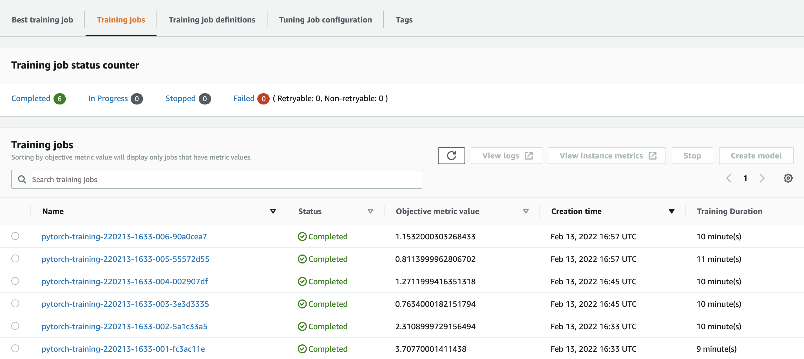

# Image Classification using AWS SageMaker

Use AWS Sagemaker to train a pretrained model that can perform image classification by using the Sagemaker profiling, debugger, hyperparameter tuning and other good ML engineering practices. This can be done on either the provided dog breed classication data set or one of your choice.

## Project Set Up and Installation
Enter AWS through the gateway in the course and open SageMaker Studio. 
Download the starter files.
Download/Make the dataset available. 

## Dataset
The provided dataset is the dogbreed classification dataset which can be found in the classroom.
The project is designed to be dataset independent so if there is a dataset that is more interesting or relevant to your work, you are welcome to use it to complete the project.

### Access
Upload the data to an S3 bucket through the AWS Gateway so that SageMaker has access to the data. 

## Hyperparameter Tuning
What kind of model did you choose for this experiment and why? Give an overview of the types of parameters and their ranges used for the hyperparameter search

### Hyperparameters
Following hyperparameters was selected for tunning:
 - model - model type, categorical hyperparameter which is used to select better model for task. Supported types "resnet18" and "resnet34"
 - batch-size - batch size, categorical hyperparameter which define batch size for training/testing/validation dataset. Supported values 128, 256 and 512
 - lr - learning rate, continuous hyperparameters which is used to find better learning rate for the model. Range from 0.001 to 0.1

Remember that your README should:
- Include a screenshot of completed training jobs
- Logs metrics during the training process
- Tune at least two hyperparameters
- Retrieve the best best hyperparameters from all your training jobs

**Tunning parameters**
All 3 types of hyperparameters was tunned in 6 training job by 2 parallel instances.

Tunning jobs losses

| Job                                       | Loss               |
|-------------------------------------------|--------------------|
| pytorch-training-220208-2035-006-cab31aee | 0.724399983882904  |
| pytorch-training-220208-2035-005-91a5e5b7 | 0.5986999869346619 |
| pytorch-training-220208-2035-004-6e8f5a97 | 6.408199787139893  |
| pytorch-training-220208-2035-003-adac21f3 | 0.9753000140190125 |
| pytorch-training-220208-2035-002-4fafad59 | 0.7390999794006348 |
| pytorch-training-220208-2035-001-7cadda9f | 0.7613999843597412 |



**Best hyperparameters**
 - batch-size: 256
 - lr: 0.0027377462797344727
 - model: resnet34
 


## Debugging and Profiling
**TODO**: Give an overview of how you performed model debugging and profiling in Sagemaker

**TODO format**
LossNotDecreasing: NoIssuesFound
VanishingGradient: NoIssuesFound
Overfit: NoIssuesFound
Overtraining: Error
PoorWeightInitialization: Error
LowGPUUtilization: IssuesFound
ProfilerReport: IssuesFound

### Results
**TODO**: What are the results/insights did you get by profiling/debugging your model?

**TODO** Remember to provide the profiler html/pdf file in your submission.


## Model Deployment
**TODO**: Give an overview of the deployed model and instructions on how to query the endpoint with a sample input.

**TODO** Remember to provide a screenshot of the deployed active endpoint in Sagemaker.

## Standout Suggestions
**TODO (Optional):** This is where you can provide information about any standout suggestions that you have attempted.

## Run script
```python hpo.py --batch-size 64 --lr 0.0063581655298423955 --epochs 3```
