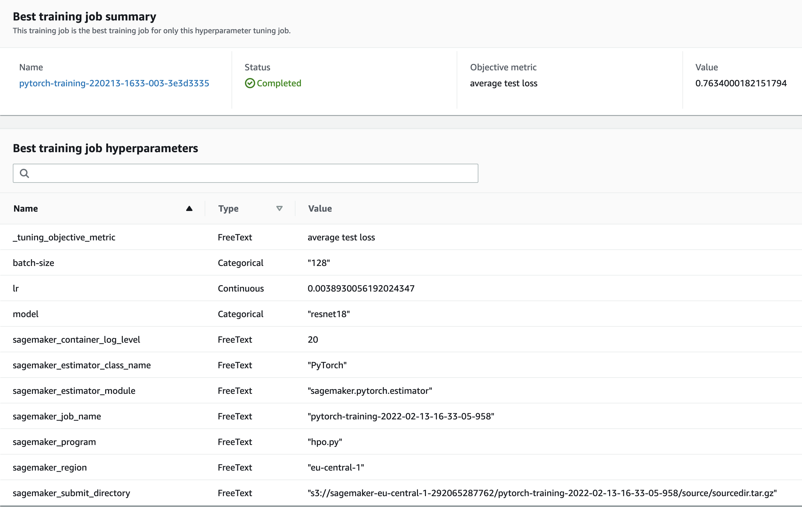

# Image Classification using AWS SageMaker

Use AWS Sagemaker to train a pretrained model that can perform image classification by using the Sagemaker profiling, debugger, hyperparameter tuning and other good ML engineering practices. This can be done on either the provided dog breed classication data set or one of your choice.

## Project Set Up and Installation
Enter AWS through the gateway in the course and open SageMaker Studio. 
Download the starter files.
Download/Make the dataset available. 

## Dataset
The provided dataset is the dogbreed classification dataset which can be found in the classroom.
The project is designed to be dataset independent so if there is a dataset that is more interesting or relevant to your work, you are welcome to use it to complete the project.

### Access
Upload the data to an S3 bucket through the AWS Gateway so that SageMaker has access to the data. 

## Hyperparameter Tuning
What kind of model did you choose for this experiment and why? Give an overview of the types of parameters and their ranges used for the hyperparameter search

### Hyperparameters
Following hyperparameters was selected for tunning:
 - model - model type, categorical hyperparameter which is used to select better model for task. Supported types "resnet18" and "resnet34"
 - batch-size - batch size, categorical hyperparameter which define batch size for training/testing/validation dataset. Supported values 128, 256 and 512
 - lr - learning rate, continuous hyperparameters which is used to find better learning rate for the model. Range from 0.001 to 0.1

Remember that your README should:
- Include a screenshot of completed training jobs
- Logs metrics during the training process
- Tune at least two hyperparameters
- Retrieve the best best hyperparameters from all your training jobs

**Tunning parameters**
All 3 types of hyperparameters was tunned in 6 training job by 2 parallel instances.

Tunning jobs losses

| Job                                       | Loss               |
|-------------------------------------------|--------------------|
| pytorch-training-220213-1633-006-90a0cea7 | 1.1532000303268433 |
| pytorch-training-220213-1633-005-55572d55 | 0.8113999962806702 |
| pytorch-training-220213-1633-004-002907df | 1.2711999416351318 |
| pytorch-training-220213-1633-003-3e3d3335 | 0.7634000182151794 |
| pytorch-training-220213-1633-002-5a1c33a5 | 2.3108999729156494 |
| pytorch-training-220213-1633-001-fc3ac11e | 3.70770001411438   |


**Best hyperparameters**
 - batch-size: 128
 - lr: 0.0038930056192024347
 - model: resnet18
 



## Debugging and Profiling
**TODO**: Give an overview of how you performed model debugging and profiling in Sagemaker
**Following training issues was found:**
 - Overfit: Error
 - Overtraining: IssuesFound
 - PoorWeightInitialization: Error
 
Overfit might be fixed:
 - play with Sagmeker rule parameters to setup overfitt condition for this particular case. For example with `patience` or `ratio_threshold`
 - by creating more complex fully connected layer with more dropout

Overtraining says that 6 epoch probably too long to train this model and we might stop training earlier.

Poor weight initialization might be fixed:

 - by adjusting rule parameters, if defaults not fit current use case
 - eventhough that pytorch initialize weights by themself, we can try other technique for that
 - try to tune rule parameters
 
**Following training instance issues was found:**
 - LowGPUUtilization: IssuesFound
 
LowGPUUtilization might be fixed:
 - increase batch size
 - take instance of smaller size


### Results
**TODO**: What are the results/insights did you get by profiling/debugging your model?
Following insignts was get from the report:
 - model can be traned less time bcs we already use pretraned model. Transfer learning allow us to spend less time on training since we need to adjust only output layer and don't need to train entire model from scratch
 - bigger batch-size might be used to utilize more CPU resources and build more cost optimized predictor
 - overfitting error need and addition investigation to undestand reason why it was triggered due to overfitted output layer or bcs model that we used consided by Sagemaker as overfitted. 

**TODO** Remember to provide the profiler html/pdf file in your submission.


## Model Deployment
**TODO**: Give an overview of the deployed model and instructions on how to query the endpoint with a sample input.

For prediction used predictor which utilize endpoint under the hood. To made a prediction following code need to be executed.

```
image = open(file, 'rb').read()
response = predictor.predict(data=image)
print(response)
```

Just send row image to predictor as `data` all the other input and output data transformation made by the script. Array will be returned as a result of prediction with dog breed class index. For example if dog image has the following path in dataset `test/001.Affenpinscher` than `0` index will be returned since dog class number is `001`.

`['72']`

To transform data and made a prediction following Sagemker methods was overridden:
 - `def input_fn(request_body, request_content_type)` to transform model input
 - `def output_fn(prediction, content_type)` to transform model output
 - `def predict_fn(input_data, model)` to predict actual result

**TODO** Remember to provide a screenshot of the deployed active endpoint in Sagemaker.


## Standout Suggestions
**TODO (Optional):** This is where you can provide information about any standout suggestions that you have attempted.

